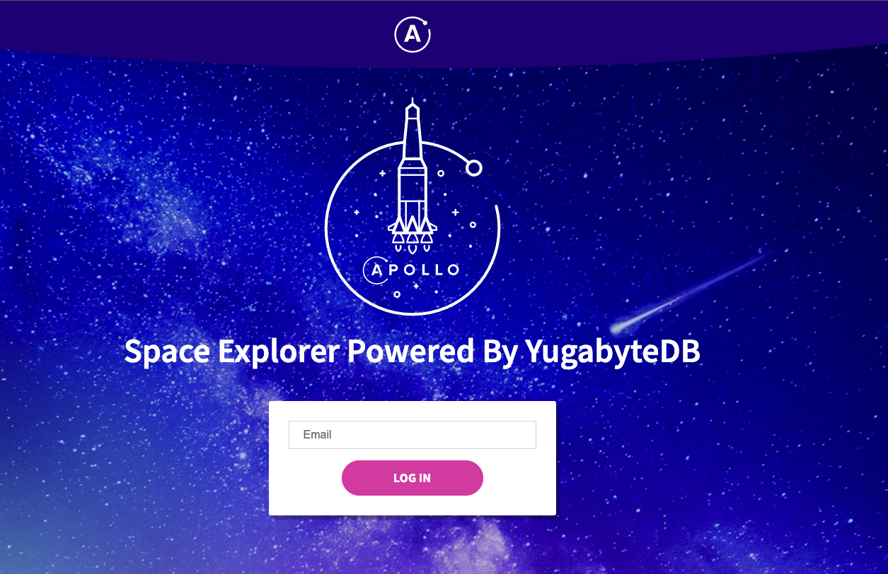

# Workshop for Getting Started with Apollo Platform with YugabyteDB Backend

This repo provides instricutions for Hands-on workshop for building GraphQL Applications with Apollo Platform configured with YugabyteDB Distributed SQL Database. This repo is extending the fullstack app for the [Apollo tutorial](http://apollographql.com/docs/tutorial/introduction.html) to use YugabyteDB Distributed Sql Database as the backend. 🚀

## Prerequisites

- Basic Understanding of GraphQL
- Basic familiarity with YugabyteDB fundamentals - https://docs.yugabyte.com/latest/explore/
- Basic familiarity with Hasura GraphQL Engine
- Basic experience with NodeJS programming
- IDE/Editor of choice - Sublime or IntelliJ or Visual Studio Code

## Technical Requirements

- Install [YugabyteDB on Mac](https://download.yugabyte.com/)
- Access to create insance on [Yugabyte Cloud](https://www.yugabyte.com/cloud/)
- Account on [Apollo Studio](studio.apollographql.com) 

## What we will build in this workshop?

The Space Explorer application is built using React and is powered by Apollo Server configured with 
YugabyteDB Distributed SQL backend database. The Application is Space Travel reservation where the APP queries 
the SpaceX rocket launch API to find the list of space travels which a user can reserve for travel.

This application has two components, Server app which implements the GraphQL schema and Resolvers 
with YugabyteDB datasource as backend for storing the mutations and The Client App which queries the GraphQL Server
for displaying the Travel options and checkout functionality for the users.

## Agenda

- Hands on Session for Implementing Space Explorer Application
- Build the Schema
- Configure Datasource using Sequalize for YugabyteDB
- Write Query Resolvers
- Write Mutation Resolvers
- Connect to Apollo Studio and Run sample queries
- Run the Client app

## Workshop Hands-on Session

Steps for running the hands-on session can be found [here](./workshop.md).